# 🍔 ZestyGo - Full Stack MERN Food Delivery Application

## 🌐 Live Demo

### 👤 User Website
https://food-delivery-two-black.vercel.app

### 🛠️ Admin Panel
https://food-delivery-7poa.vercel.app

### ⚙️ Backend API
https://food-delivery-3cas.onrender.com

---

A modern **Full Stack MERN Food Delivery Web Application** that allows users to browse food items, manage their cart, place orders securely using Stripe Payment Gateway, and enables administrators to manage food items and customer orders through a dedicated admin dashboard.

---

## 🚀 Features

### 👤 User Features

- User Registration & Login
- JWT Authentication
- Browse Food Menu
- Search Food Items
- Add to Cart
- Update Cart Quantity
- Secure Stripe Payment
- Place Orders
- Order History
- Responsive UI

---

### 👨‍💼 Admin Features

- Admin Login
- Add New Food Items
- Upload Food Images
- Delete Food Items
- View Customer Orders
- Update Order Status

---

## 🛠 Tech Stack

### Frontend

- React.js
- Vite
- CSS
- Axios

### Backend

- Node.js
- Express.js
- MongoDB Atlas
- JWT Authentication
- Multer
- Stripe Payment Gateway

---

## 📂 Project Structure

```text
Food-Delivery
│
├── admin
├── backend
└── frontent
```

---

## ⚙️ Installation

### Clone Repository

```bash
git clone https://github.com/GauravTiwari187/Food-Delivery.git
```

### Install Dependencies

#### Frontend

```bash
cd frontent
npm install
npm run dev
```

#### Backend

```bash
cd backend
npm install
npm run server
```

#### Admin

```bash
cd admin
npm install
npm run dev
```

---

## 🔐 Environment Variables

Create a `.env` file inside the backend folder.

```env
PORT=
MONGODB_URI=
JWT_SECRET=
STRIPE_SECRET_KEY=
```

---

## 📷 Screenshots

### 🏠 Home Page

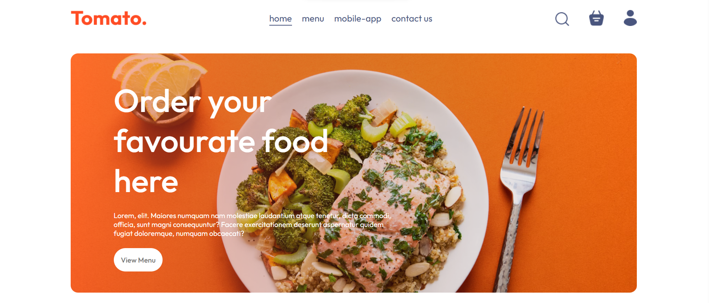

### 🍽️ Food Menu

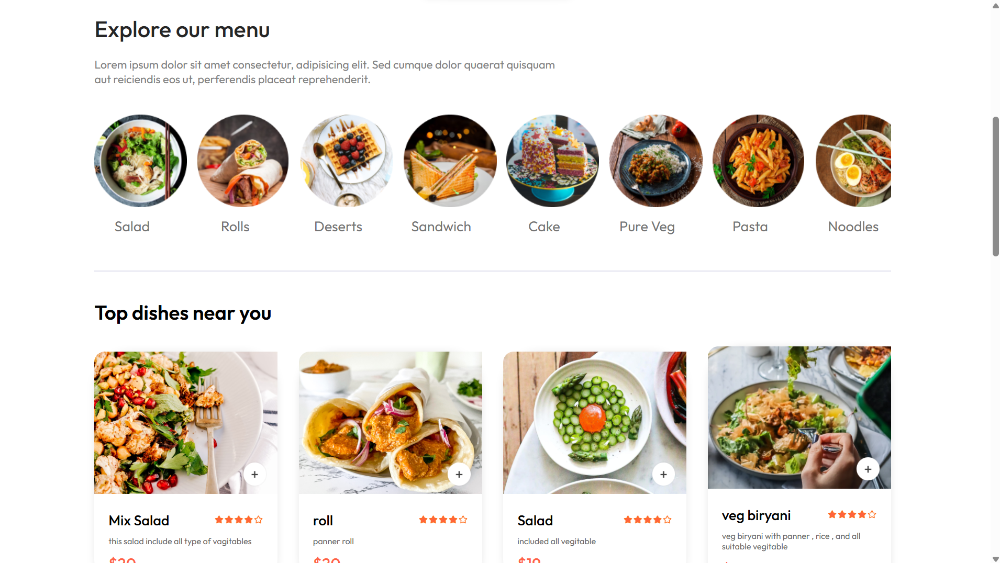

### 🍕 Dishes

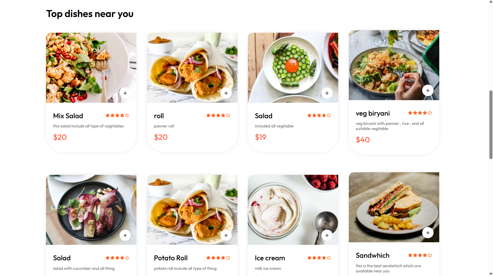

### 🛒 Shopping Cart

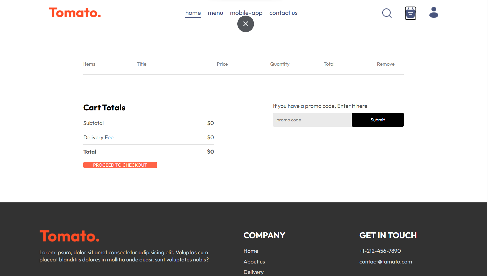

### 📍 Delivery Information

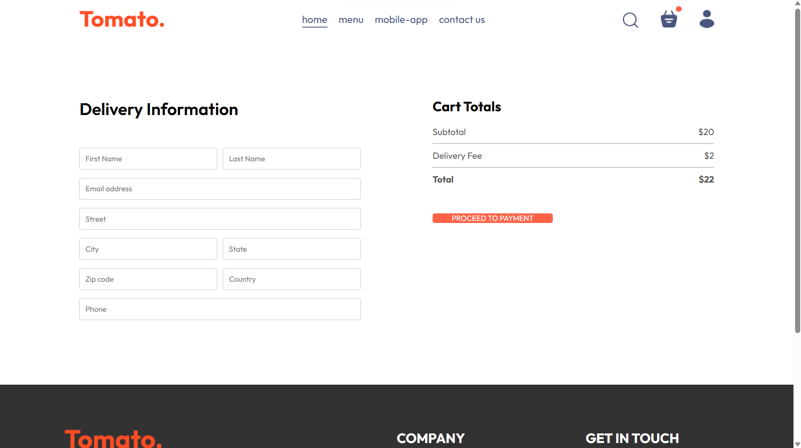

### 💳 Stripe Payment

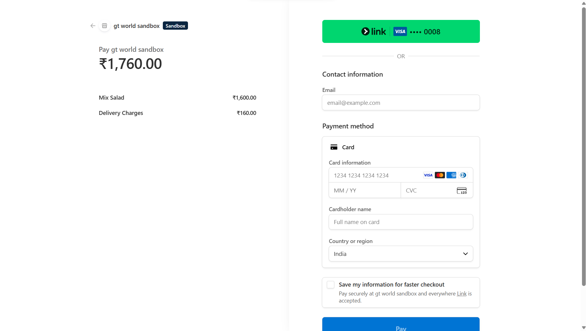

### 📦 My Orders

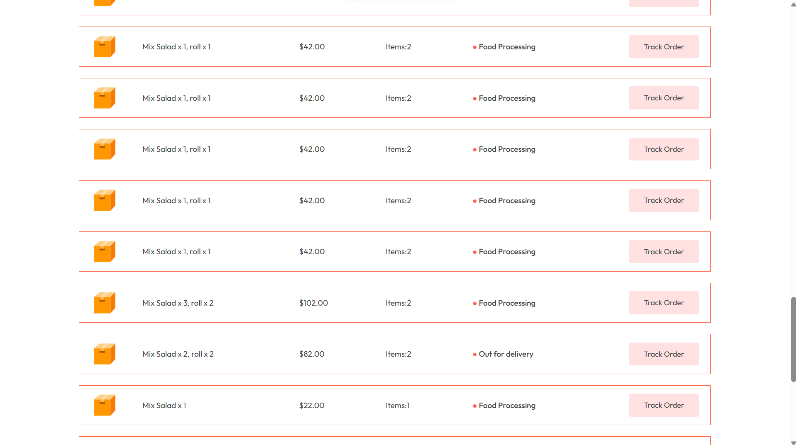

### 📄 Order Page

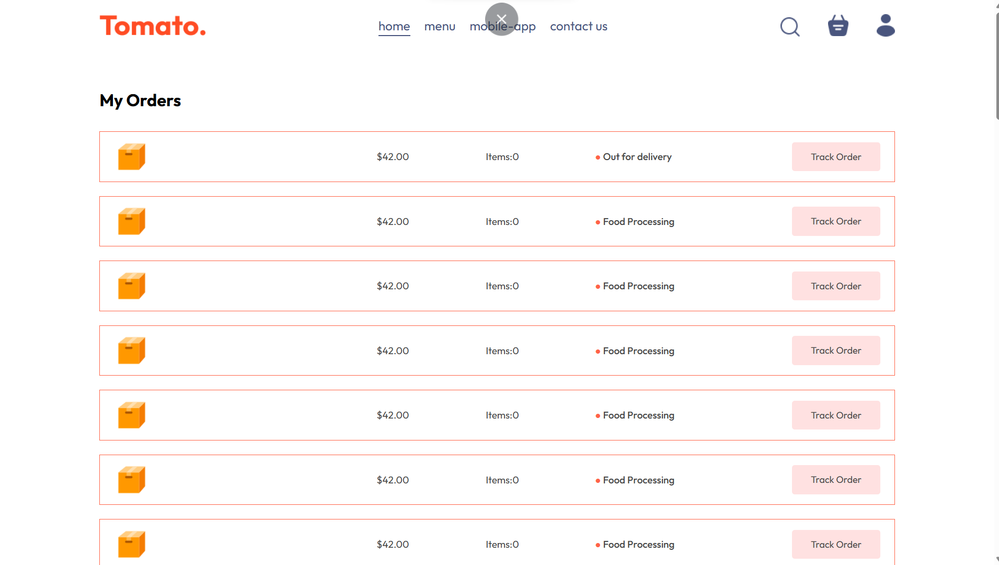

### 🚚 Order Status

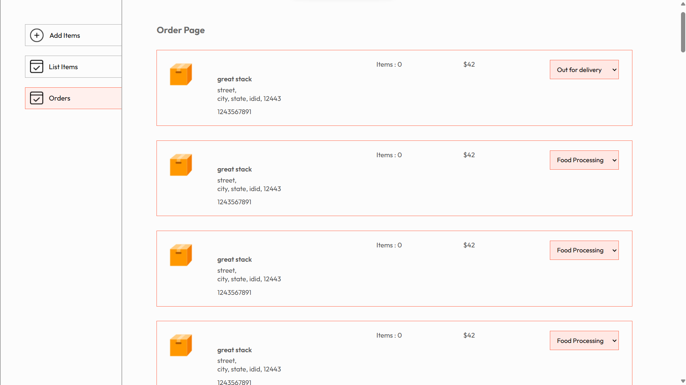

### 🛠️ Admin Dashboard

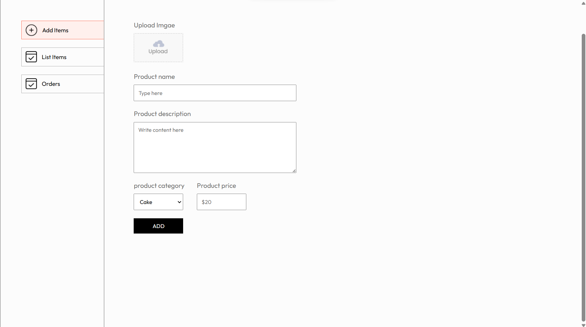

### 📋 Manage Orders

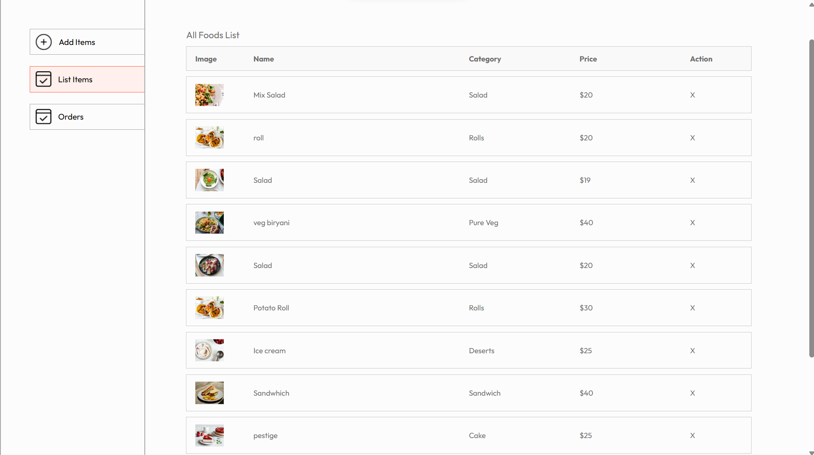

---

## 🌟 Future Improvements

- Email Notifications
- Wishlist
- Coupons & Discounts
- Online Table Booking
- Real-time Order Tracking
- Google Authentication

---

## 👨‍💻 Developer

**Gaurav Tiwari**

GitHub:
https://github.com/GauravTiwari187

---

## ⭐ If you like this project

If you found this project helpful, please give it a ⭐ on GitHub.
